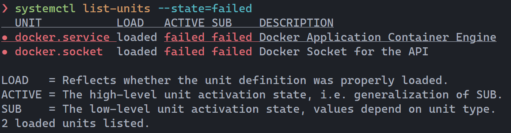
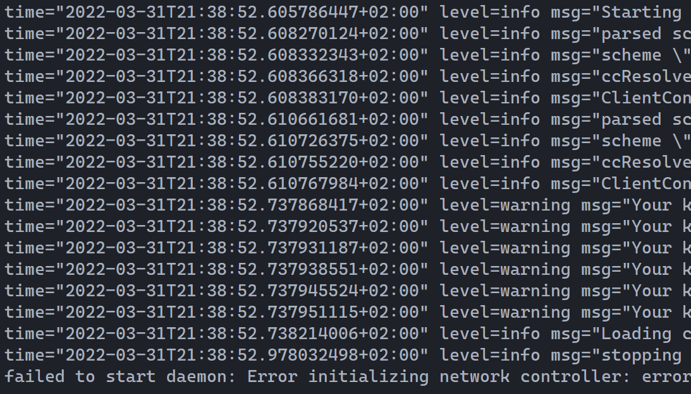
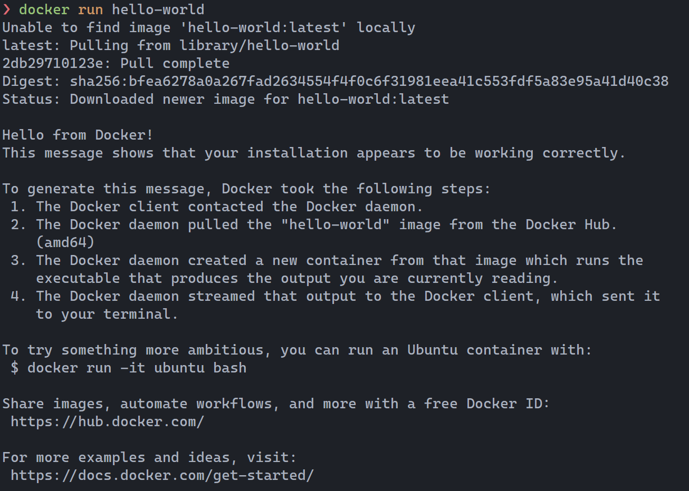
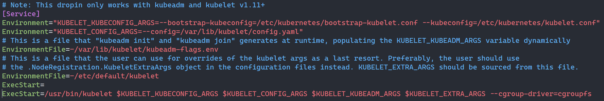
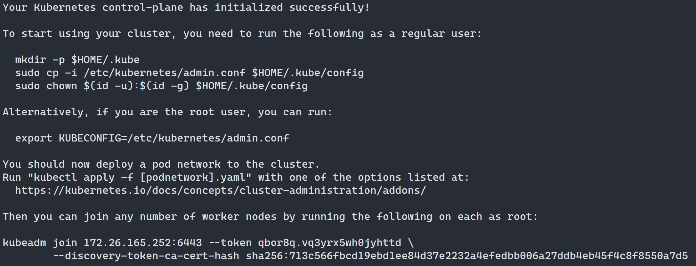
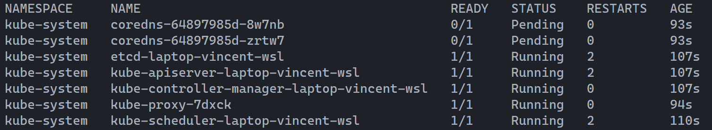
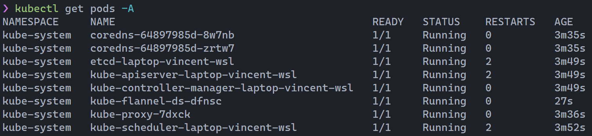
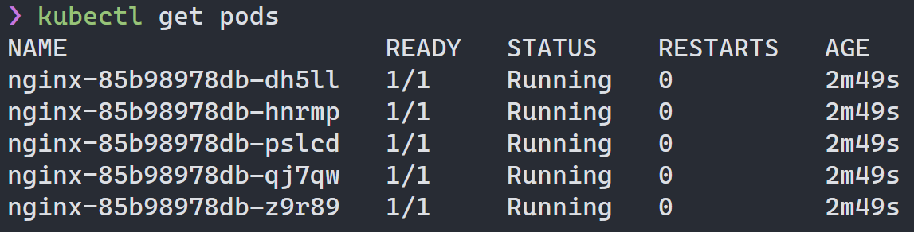

+++
title="Kubernetes cluster on WSL2 with Systemd, Docker and Kubeadm"
slug="installing-systemd-docker-kubernetes-wsl-deploy-kubeadm"
date="2022-04-01"

[taxonomies]
tags = ["devops", "kubernetes", "docker", "systemd", "wsl2"]
+++

## Foreword

In the course of taking my Kubernetes self-education a bit more seriously,
I've been keen on setting up a cluster from "nothing" locally.
I previously was using the mediation of the excellent [`minikube`](https://minikube.sigs.k8s.io/docs/start/) to get a cluster and nodes running instantly on a docker-enabled machine.
In fact it is still what I'd recommend to any aspirational k8s admin.
But I wanted the real thing. I wanted to be familiar with `kubeadm`, configuring a cluster from a blank state and all that good stuff.

Here's the problem : my development Linux machine happens to be a WSL2 Debian virtual machine on Windows 10.
WSL2 doesn't have `systemd`. Container backends need `systemd`, including Docker - at least _the kind of Docker you need_. As far as a vanilla install of WSL2 Debian goes, you simply can't run `kubeadm` on it.

Thus two paths were in front of me :

- Be a good boy and just deploy a VM on a cloud provider, or even run one locally.
- Be set in my ways and refuse to leave the comfort of my usually dev environment.

I obviously took the second path, as any self-important engineer would.

**While this post assumes you're running Debian 11 or 12 on WSL2, it may be broadly useful to any other Linux distro.**

## Systemd on WSL2 : get the `genie`out of the bottle

As said above, WSL2 simply doesn't ship with `systemd`. And going by the issues on Github, it probably never will.
A few Google search later, you might find yourself contemplating obscure and out-of-date shell script for a distribution that not's even yours.
And digging more, you may find a project that's remarkably well put, contained and saved the life of this blog post : [`genie`](https://github.com/arkane-systems/genie).

`genie` uses [namespacing](https://en.wikipedia.org/wiki/Linux_namespaces), itself one of the [container primitives](https://www.youtube.com/watch?v=sK5i-N34im8), system daemons written in Python through the library [daemonize](https://daemonize.readthedocs.io/en/latest/) as well as some other black magic to provide a completely usable systemd interface.
`genie` being something of a sandbox, or a _bottle_ as they call it, systemd services have to be ran from _inside of it_.
But making sure you're always inside of `genie` rather trivial, as we'll see later.

### Installing `genie`

There is a user-maintained Debian/Ubuntu repository targeting WSL installation. Use at your own risk. Cautious people can compile the thing from source.

Run as `sudo -s` :

```bash
apt install lsb-release &&
wget -O /etc/apt/trusted.gpg.d/wsl-transdebian.gpg https://arkane-systems.github.io/wsl-transdebian/apt/wsl-transdebian.gpg &&
chmod a+r /etc/apt/trusted.gpg.d/wsl-transdebian.gpg &&
cat << EOF > /etc/apt/sources.list.d/wsl-transdebian.list
deb https://arkane-systems.github.io/wsl-transdebian/apt/ $(lsb_release -cs) main
deb-src https://arkane-systems.github.io/wsl-transdebian/apt/ $(lsb_release -cs) main
EOF &&
apt update &&
apt install -y systemd-genie
```

Now you simply have to run `genie -s` and _voilà_, you've got `systemd` !

You might want to disable `getty@tty1.service` as it is useless for WSL2 :

```bash
sudo systemctl disable getty@.service
```

### Common bugs

Check with `systemctl list-units --state=failed` to see if any `systemd-*` service has failed to start.
If there are, go look at the `genie` wiki page on [`systemd` units known to be problematic with WSL](https://github.com/arkane-systems/genie/wiki/Systemd-units-known-to-be-problematic-under-WSL), which contains numerous fixes for commonly failing services. My desktop installation was failing `systemd-sysusers.service` while my laptop got it perfect from the get go.

### Always run your shell within `genie`

One traditional solution to make sure `systemd` is always available to you is to simply run `genie -s` inside your shell's rc files, say `.bashrc` or `.zshrc`.

My preferred approach is to simply pass `genie -s` as a flag of `wsl.exe` itself. Your shell will naturally start inside of it. The good point to that approach is that it remains machine-specific.

Thus, [Windows Terminal](https://github.com/microsoft/terminal) being my terminal emulator of choice, I've just replaced the Debian command line with `wsl.exe -d Debian genie -s` in the `Settings` under `Profiles`.

## Running Debian-native Docker as a container backend

The canonical way of running Docker on Windows, with or without using WSL2, is to use [Docker Desktop](https://docs.docker.com/desktop/windows/install/). It ships with WSL2 integration which puts symbolic links to the Windows binaries in the Linux file system. It works fantastically well for most use cases you'd ever encounter using containers on WSL2, but it doesn't work for _this use case_ as `kubelet` expects a UNIX socket and a container daemon service to be available.

### Cleaning up

Before going any further, make sure you uninstall Docker Desktop if it's present in your system and inside of WSL2 run `sudo rm /usr/bin/docker*` to cleanup the dangling symbolic links which might conflict with `apt`.

I also **highly** encourage you to change the WSL2 DNS config a bit, it has a tendency to break itself regularly and might prevent you to pull Docker images properly. This will set your DNS to Google's and will prevent it from getting overwritten :

```bash
sudo tee /etc/wsl.conf > /dev/null << EOF
[network]
generateResolvConf=false
EOF

echo -e 'nameserver 8.8.8.8\nnameserver 8.8.4.4' | sudo tee /etc/resolv.conf > /dev/null;
sudo chattr -f +i /etc/resolv.conf;
```

### Installing Docker

There's nothing special about it, just follow the instructions from the Docker documentation.
I'm setting the distro name by hand rather than relying on `lsb_release` as the official Docker repositories doesn't have an entry for `bookworm` (which I'm running) yet. This block works for both `bullseye` and `bookworm`.

```bash
sudo apt-get update &&
sudo apt-get install ca-certificates curl gnupg &&
curl -fsSL https://download.docker.com/linux/debian/gpg | sudo gpg --dearmor -o /usr/share/keyrings/docker-archive-keyring.gpg &&
echo "deb [arch=$(dpkg --print-architecture) signed-by=/usr/share/keyrings/docker-archive-keyring.gpg] https://download.docker.com/linux/debian bullseye stable" | sudo tee /etc/apt/sources.list.d/docker.list > /dev/null &&
sudo apt-get update &&
sudo apt-get install docker-ce docker-ce-cli containerd.io
```

Make sure your user is in the `docker` group, so you can use containers without `sudo` and avoid other side effects :

```bash
sudo groupadd docker &&
sudo usermod -aG docker $USER &&
newgrp docker
```

Enable `docker.service` :

```bash
sudo systemctl enable docker.service
```

### Post-install fixes

If everything went well, Docker is not working yet !

`systemctl --failed` should tell you `docker.service`and `docker.socket` can't start up.



And a look at `journalctl -xeu docker.service` will tell you something is wrong with the network, or really with `iptables`.



First, you need to tell Docker where to find the socket and not to use `iptables`.

```bash
echo -e "{
        \"hosts\": [\"unix:///var/run/docker.sock\"],
        \"iptables\": false
}" | sudo tee /etc/docker/daemon.json > /dev/null
```

Then you need to remove the host flag (`-H`) from the `docker.service` `ExecStart` line. You can `sudo vi` it or simply use this one-liner :

```bash
sudo sed -i 's/-H fd:\/\/ //g' /etc/systemd/system/multi-user.target.wants/docker.service
```

Next, reload the daemon configuration files and restart the docker service :

```bash
sudo systemctl daemon-reload &&
sudo systemctl restart docker.socket &&
sudo systemctl restart docker.service
```

Docker should be up and running. If `sudo systemctl daemon-reload` fails with some network or socket error, just close your WSL terminals, pop a Powershell terminal in Administrator mode and shutdown wsl with `wsl --shutdown`. Restarting a WSL terminal will also restart WSL and it should now work.

At this point, you should be able to run `docker run hello-world` and confirm everything is working well.



## Running a Kubernetes cluster

### Installing `kubectl`, `kubelet` and `kubeadm`

First setup the Google k8s repository and install the packages :

```bash
sudo apt-get update && sudo apt-get install -y apt-transport-https curl &&
curl -s https://packages.cloud.google.com/apt/doc/apt-key.gpg | sudo apt-key add - &&
echo "deb https://apt.kubernetes.io/ kubernetes-xenial main" | sudo tee /etc/apt/sources.list.d/kubernetes.list &&
sudo apt-get update &&
sudo apt-get install -y kubelet kubeadm kubectl
```

The _normal_ behaviour of `kubelet` with Docker installed on the same machine is to automatically detect the [cgroup](https://en.wikipedia.org/wiki/Cgroups) driver. It doesn't quite work on WSL2. The Kubernetes documentation states that `/var/lib/kubelet/config.yaml` should be used to configure it, but as it happens the file gets overwritten upon invocation of `kubeadm init`. Thus our only options is to use the _deprecated_ `--cgroup-driver` flag in `kubelet`'s `ExecStart`. In our case the driver is `cgroupfs`.

Open `/etc/systemd/system/kubelet.service.d/10-kubeadm.conf` and edit it so that the `ExecStart` line looks like this:



```
ExecStart=/usr/bin/kubelet $KUBELET_KUBECONFIG_ARGS $KUBELET_CONFIG_ARGS $KUBELET_KUBEADM_ARGS $KUBELET_EXTRA_ARGS --cgroup-driver=cgroupfs
```

Another issue that most likely will prevent `kubelet` from starting on a WSL machine is swap. It's enabled by default on WSL2, but will make `kubelet` fail unless stated otherwise.
There are two ways to solve this :

- Disable swap on WSL2. Edit `C:/Users/$User/.wslconfig` on the Windows side or `/mnt/c/Users/$User/.wslconfig` on the Linux side, add the line `swap=0` and restart the wsl with `wsl --shutdown` in a Powershell Administrator terminal.

  ```
  [wsl2]
  swap=0
  ```

- Allow `kubelet` to start with swap on. It's something you should really never do on a production server, but it's not an issue on local machine where reliability and consistency are not concerns. To do so, simply add a configuration file in `/etc/systemd/system/kubelet.service.d/`:

  ```bash
  echo -e "[Service]
  Environment=\"KUBELET_EXTRA_ARGS=--fail-swap-on=false\"" | sudo tee /etc/systemd/system/kubelet.service.d/20-allow-swap.conf > /dev/null
  ```

Once your `cgroup-driver` is set and your swap is dealt with, you should be able to run `kubelet` :

```bash
sudo systemctl daemon-reload &&
sudo systemctl restart kubelet
```

### Our first cluster

We're ready to role ! We'll start by initializing a brand new master node for our cluster with one option : a [CIDR](https://en.wikipedia.org/wiki/Classless_Inter-Domain_Routing) range for pods. While it is not strictly speaking necessary to init a cluster, we'll need it later. The entire `10.0.0.0/8` range is private, which gives use a comfortable 2^24 IPs, that is over 16 millions, to play with. For this example I'll use `10.200.0.0/16`.

```bash
kubeadm init --pod-network-cidr=10.200.0.0/16
```

If everything goes well, you should see something like this :



**If it's not working**, it means `kubectl` isn't starting properly. Check for errors with `journalctl -xeu kubelet.service`. If it's about swap or the `cgroup-driver`, go back up to the section above. I'm not familiar with other issues that might crop up.
In any case, after a failed try, you need to cleanup your files before doing another `kubeadm init` :

```bash
sudo kubeadm reset
```

If it's working, just follow the instructions at the end of the prompt. You might want to write down the `kubeadm join ...` string at the bottom if you want to set up extra nodes. This will simply put the new cluster in your `kubectl` context :

```bash
mkdir -p $HOME/.kube &&
sudo cp -i /etc/kubernetes/admin.conf $HOME/.kube/config &&
sudo chown $(id -u):$(id -g) $HOME/.kube/config
```

At this point, if you run `kubectl get pods -A` you should see running system pods. Congratulations, you've got a cluster!



But what's going on with that [CoreDNS](https://coredns.io/) thing ? Well CoreDNS is a DNS server that manages DNS records for pods as well as service discovery. As such, it expects a [pod network](https://kubernetes.io/docs/concepts/cluster-administration/networking/). There is no standard implementation of the Kubernetes networking model and Kubernetes doesn't ship with one, it's up to us to provide it.

I've chosen [Flannel](https://github.com/flannel-io/flannel#flannel), which is lightweight and widely used. Flannel happens to require an explicit pod network CIDR, hence the reason why we used it at `kubeadm init` time.
Deploying Flannel on our cluster is extremely simple, it just requires to apply a configuration file from the Flannel Github repository :

```bash
kubectl apply -f https://raw.githubusercontent.com/flannel-io/flannel/master/Documentation/kube-flannel.yml
```

Wait a minute or so, try `kubectl get pods -A` and you should be seeing something like that :



**Success !** We have a fully functional base cluster running ! All we're lacking is some nodes to run pods on !

### Setting up nodes

By default, the master node has taints preventing you from running pods on it. You can untaint it with :

```bash
kubectl taint nodes --all node-role.kubernetes.io/master-
```

With this done, you can deploy pods on your cluster as is :

```bash
kubectl create deployment nginx --image=nginx --replicas=5
```



If you would rather deploy separate worker nodes, then you'll need to use `kubeadm join` on a different machine that can communicate over the network with your master node. You can use the string from the master node you should have saved, or you can generate a new token and join string with :

```bash
sudo kubeadm token create --print-join-command
```

Then to join, on the worker node :

```
sudo kubeadm join ...
```

There are many ways to join nodes and connect between them, I'll let you check the [documentation](https://kubernetes.io/docs/reference/setup-tools/kubeadm/kubeadm-join/).
